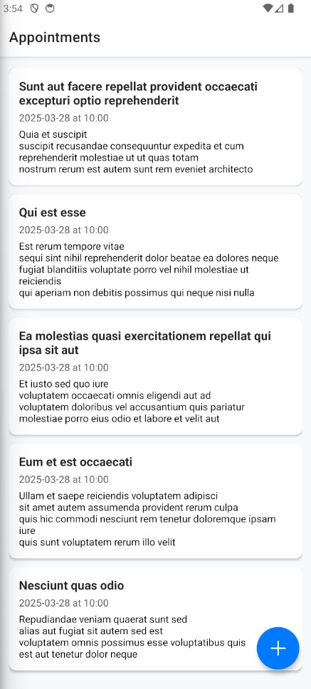
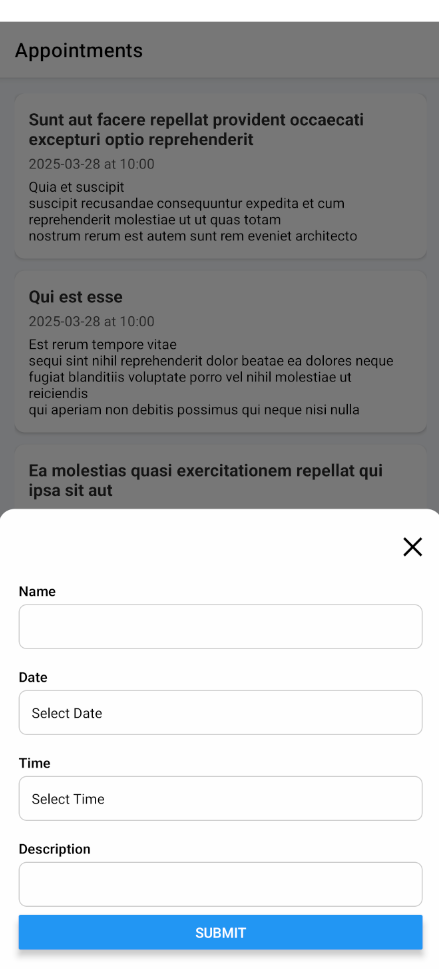

# Appointment Scheduler App 📅

A well-crafted appointment scheduling app built with **React Native (Expo)**, **TypeScript**, and **Redux Toolkit**.

This technical challenge demonstrates clean architecture, state management, async API integration, modals, validation, animations, and testing — all with attention to detail and visual polish.

---

## 🚀 Features

- ✅ View a list of scheduled appointments (GET)
- ✅ Create a new appointment via modal popup (POST)
- ✅ Global state management using Redux Toolkit
- ✅ Form validation with **React Hook Form** + **Zod**
- ✅ UI modal implemented as a **component**, not a screen
- ✅ Loading and error feedback on all requests
- ✅ Capitalized text styling for a polished UI
- ✅ Entry animations using `Animated.View`
- ✅ Unit tests for reducer and form logic

---

## 🧠 Key UX Details

- ✨ Add button opens a **popup modal** (not a screen transition)
- ✨ Modal slides from the bottom on Android with dismiss button
- ✨ Capitalization applied to appointment titles and descriptions
- ✨ Inputs styled for clarity, readability, and accessibility

---

## 🛠 Tech Stack

- [React Native + Expo](https://expo.dev/)
- [TypeScript](https://www.typescriptlang.org/)
- [Redux Toolkit](https://redux-toolkit.js.org/)
- [React Hook Form](https://react-hook-form.com/)
- [Zod](https://zod.dev/)
- [React Native Animated](https://reactnative.dev/docs/animated)
- [Jest](https://jestjs.io/)
- [React Native Testing Library](https://testing-library.com/docs/react-native-testing-library/intro)

---

>
## 📸 Screenshots

Here are some screenshots of the app in action:

### Appointment List



### Add Appointment Modal



---

## 📦 How to run the project

**Clone the repository**:

  ```bash
  git clone https://github.com/PowerOfMind/appointment-scheduler-careexpand
  cd appointment-scheduler
  ```

**Install dependencies**:

  ```bash
  npm install
  ```

**Start the Expo server**:

  ```bash
  npm run start
  ```

**run test**:

  ```bash
  npm test
  ```

Tests include:

✅ Redux reducer logic

---

## 🔮 Improvements with more time

- 🧠 Better error UI: Inline error messages, retry buttons, and network status indicators.

- 💾 Persistent storage: Save appointments locally using AsyncStorage or connect to a - real backend with authentication.

- 🎨 Dark mode: Dynamic theme support based on system preference or toggle.

- 🌍 i18n: Multi-language support with react-i18next.

- 📱 Responsive design: Improve layout for tablets and large-screen Android devices.

- 💬 Toast feedback: Visual feedback for actions (e.g., "Appointment created").

- 🎯 Search & filter: Filter by name/date or implement a search bar.

- 🧪 Integration tests: Add form-to-API flow tests with mocks.

- 🔄 Swipe to delete/edit: Add swipe gestures or context menus on each appointment.

- 📅 Calendar view: Show appointments visually using a calendar component.

- 🔐 Authentication flow: Add user login/register and link appointments per user.

- 🧱 More modular components: Extract form fields and layout blocks into atomic/reusable components.

---

## 🧱 Project Structure

src/

- components/              # UI components like the appointment form modal
- redux/                  # Redux slices and store setup
- screens/                # Main screen for listing appointments
- api/ # API mocks or future API integration
